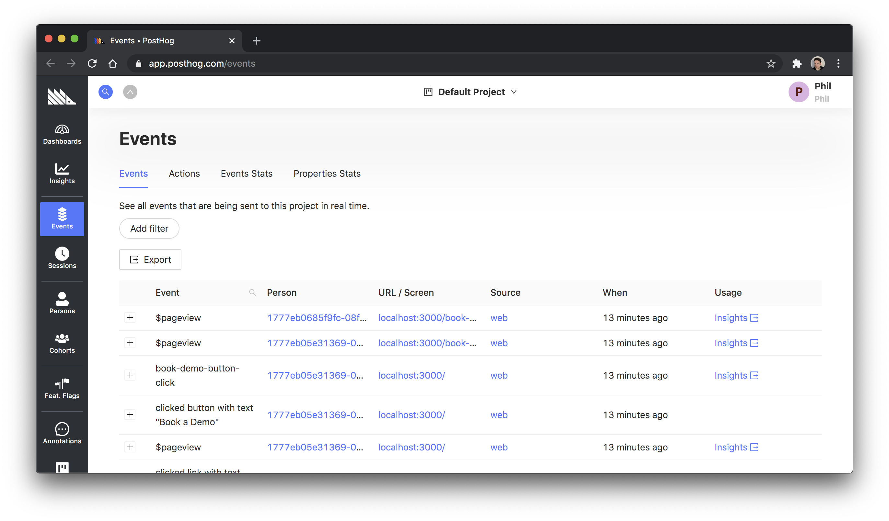
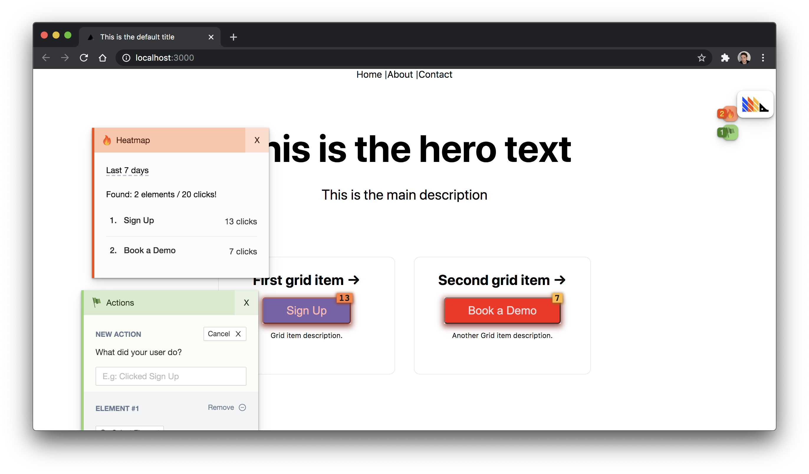
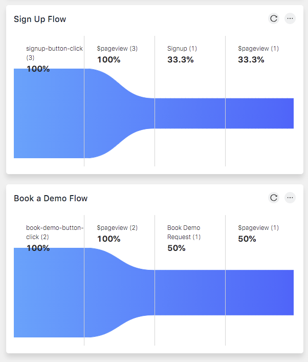

An example of using [PostHog](https://posthog.com) for analytics with a [Next.js](https://nextjs.org/) application.

## Deploy your own

[Sign up for a PostHog Cloud account](https://app.posthog.com/signup).

Deploy the example using [Vercel](https://vercel.com?utm_source=github&utm_medium=readme&utm_campaign=next-example-leggetter):

[](https://vercel.com/new/git/external?repository-url=https://github.com/leggetter/with-posthog&project-name=with-google-analytics&repository-name=with-posthog)

Remember to setup your `NEXT_PUBLIC_POSTHOG_TOKEN` [environment variable](https://vercel.com/docs/environment-variables) in Vercel.

## How to use

Execute [`create-next-app`](https://github.com/vercel/next.js/tree/canary/packages/create-next-app) with [npm](https://docs.npmjs.com/cli/init) or [Yarn](https://yarnpkg.com/lang/en/docs/cli/create/) to bootstrap the example::

```bash
npx create-next-app --example https://github.com/leggetter/with-posthog
# or
yarn create next-app --example https://github.com/leggetter/with-posthog
```

### Setup PostHog

[Sign up for a PostHog Cloud account](https://app.posthog.com/signup)

Once you have your account, create a copy of the `.env.local` configuration file from the example `.env.local.example` file:

```
cp .env.local.example .env.local
```

Update the `NEXT_PUBLIC_POSTHOG_TOKEN` variable in the new `.env.local` file with your PostHog token.

### Deploy to Vercel

Deploy it to the cloud with [Vercel](https://vercel.com/new?utm_source=github&utm_medium=readme&utm_campaign=next-example-leggetter) ([Documentation](https://nextjs.org/docs/deployment)).

Create and set an environment variable for `NEXT_PUBLIC_POSTHOG_TOKEN` using the following command and when prompted enter your PostHog token and select `a` for all environments:

```
vercel env add secret NEXT_PUBLIC_POSTHOG_TOKEN
```

Deploy:

```
vercel
```

## Running Locally

Run the development server:

```bash
npm run dev
# or
yarn dev
```

Open [http://localhost:3000](http://localhost:3000) with your browser to see the result.

You can start editing the page by modifying `pages/index.js`. The page auto-updates as you edit the file.

## Learn More

### PostHog

Demonstates using [PostHog](https://posthog.com) for:

- [Page Views](https://posthog.com/docs/integrations/js-integration#one-page-apps-and-page-views)
- [Custom Events/Capture via JS Web](https://posthog.com/docs/integrations/js-integration#sending-events)
- [Setting identity via JS Web](https://posthog.com/docs/integrations/js-integration#identifying-users)
- [Custom Events/Capture via Node.js](https://posthog.com/docs/integrations/node-integration#capture)


**PostHog events dashboard**


**PostHog toolbar**


**PostHog Funnel**


To learn more about PostHog, take a look at the following resources:

- [PostHog documentation](https://posthog.com/docs)
- [posthog-js integration](https://posthog.com/docs/integrations/js-integration)
- [posthog-node integration](https://posthog.com/docs/integrations/node-integration)

### Next.js

This is a [Next.js](https://nextjs.org/) project bootstrapped with [`create-next-app`](https://github.com/vercel/next.js/tree/canary/packages/create-next-app).

To learn more about Next.js, take a look at the following resources:

- [Next.js Documentation](https://nextjs.org/docs) - learn about Next.js features and API.
- [Learn Next.js](https://nextjs.org/learn) - an interactive Next.js tutorial.

You can check out [the Next.js GitHub repository](https://github.com/vercel/next.js/) - your feedback and contributions are welcome!

## Deploy on Vercel

The easiest way to deploy your Next.js app is to use the [Vercel Platform](https://vercel.com/import?utm_medium=default-template&filter=next.js&utm_source=github&utm_campaign=next-example-leggetter) from the creators of Next.js.

Check out our [Next.js deployment documentation](https://nextjs.org/docs/deployment) for more details.
